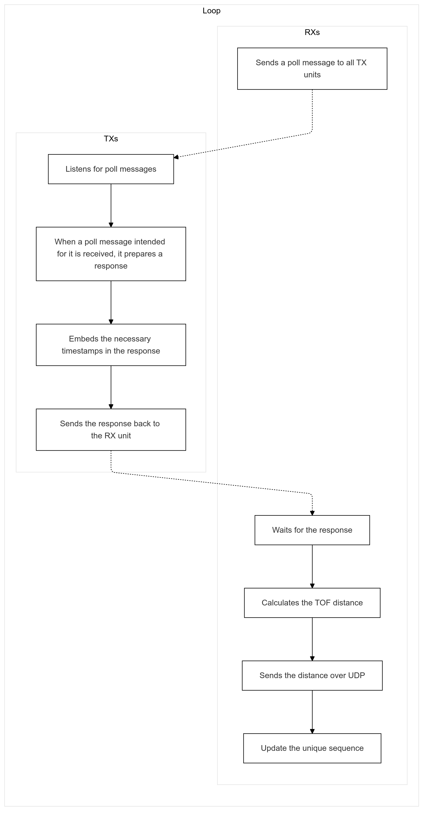
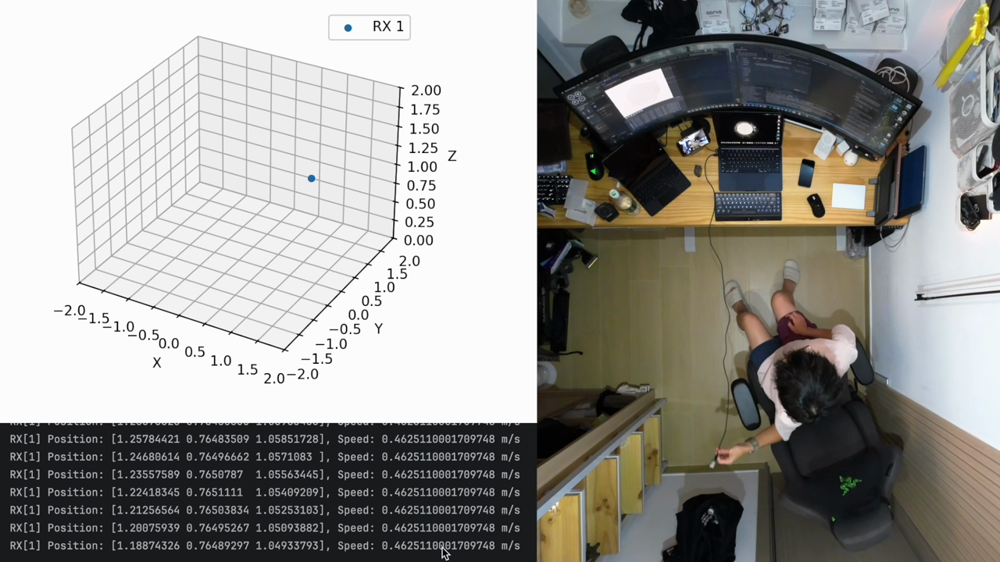
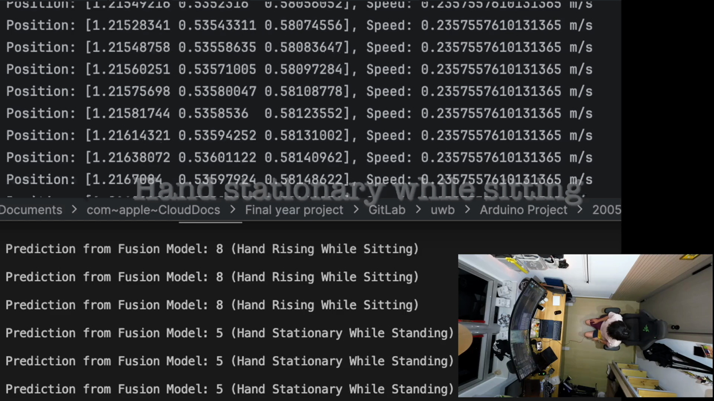
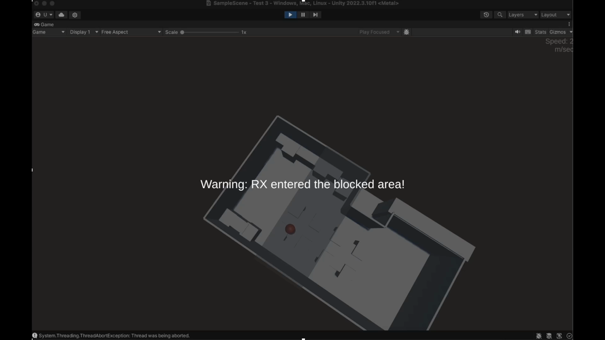
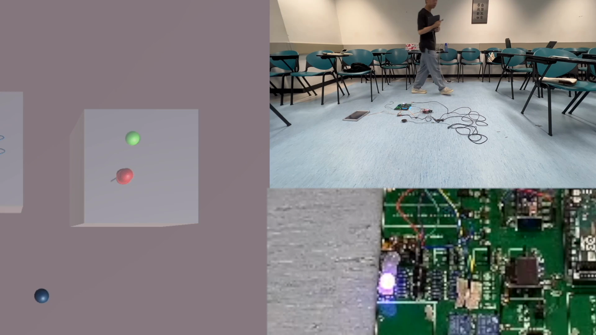
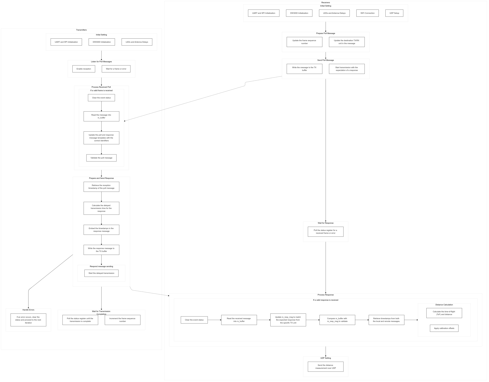
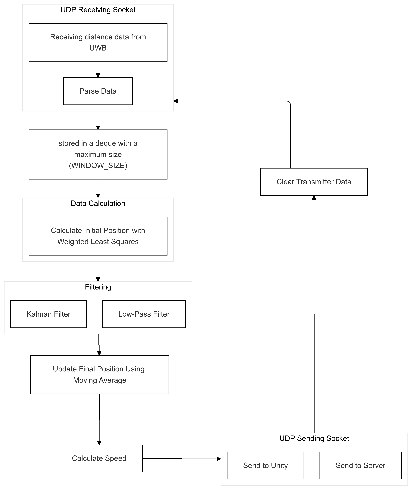
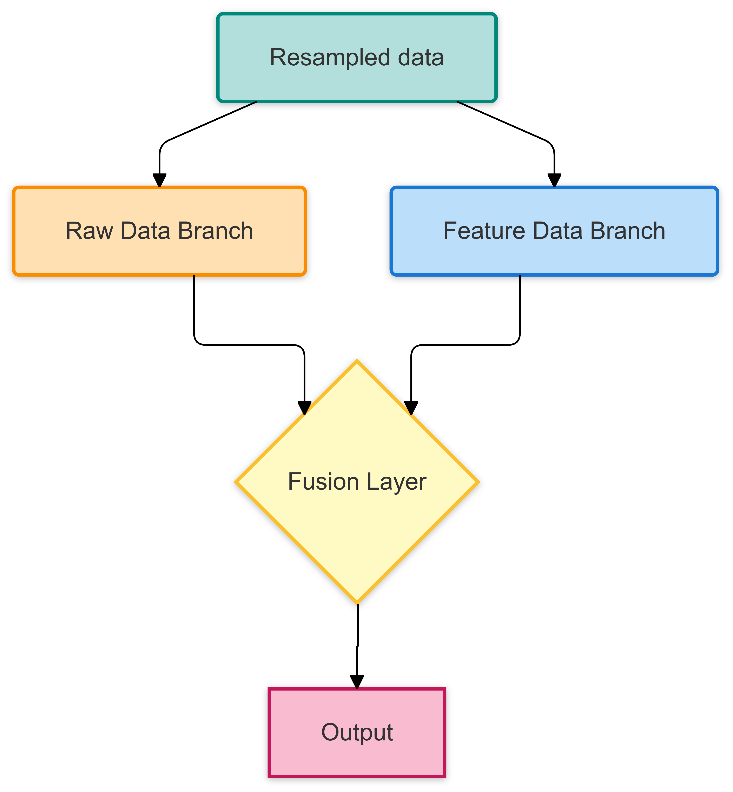
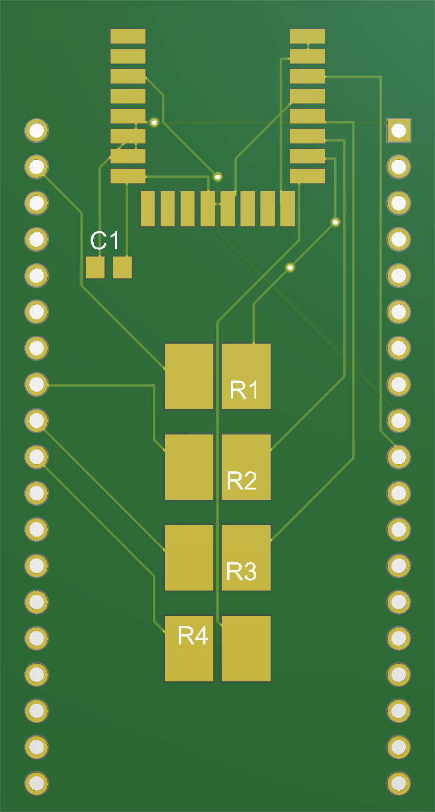

# Ripple Structures

**DWM3000 Ultra-Wideband 4D Indoor Positioning, Gesture Recognition, and Unity Visualization**

Ripple Structures is an indoor sensing project built around DWM3000 ultra-wideband ranging modules. It combines Arduino receiver/transmitter firmware, a Python real-time positioning and plotting server, ML gesture-recognition scripts, a Unity visualizer, and custom PCB/case hardware.



## Demo

[](docs/media/ripple-structures-demo.mp4)

[Watch the main real-time 3D positioning demo](docs/media/ripple-structures-demo.mp4), or open the individual demo clips below. These clips were extracted from the final presentation and arranged as separate sessions in [docs/demo.md](docs/demo.md). The private scanned Unity room scene and PowerPoint Media 4 are intentionally excluded.

| Session | Demo |
| --- | --- |
| Real-time 3D positioning | [](docs/media/demos/media01-real-time-3d-positioning.mp4) |
| Gesture recognition prediction | [](docs/media/demos/media02-gesture-recognition-prediction.mp4) |
| Boundary triggering in Unity | [](docs/media/demos/media10-boundary-triggering-in-unity.mp4) |
| Two-receiver LED boundary triggering | [](docs/media/demos/media12-two-receiver-led-boundary-triggering.mp4) |

## System Overview

- `firmware/transmitter/` sends DWM3000 UWB ranging messages from mobile transmitter nodes.
- `firmware/receiver/` receives DWM3000 UWB range measurements, applies per-anchor calibration, and forwards measurements over WiFi/UDP.
- `software/positioning_server/` estimates receiver position, filters samples, plots live data, and forwards coordinates to Unity.
- `software/ml/` contains the final computing, model training, model testing, fusion, and plotting scripts.
- `unity/ripple-visualizer/` contains the reusable Unity scripts and project configuration for visualizing tracked users.
- `hardware/` contains DWM3000/ESP32-C3 PCB design files, reference Gerbers, and 3D-printable enclosure files.

## Architecture

Core diagrams are included in [docs/architecture.md](docs/architecture.md):





## Quick Start

1. Copy `firmware/transmitter/config.example.h` to `firmware/transmitter/config.h`, set the DWM3000 transmitter ID, and flash `TX.ino`.
2. Copy `firmware/receiver/config.example.h` to `firmware/receiver/config.h`, set WiFi/network details, DWM3000 anchor coordinates, calibration offsets, and flash `RX.ino`.
3. Install Python dependencies and run the positioning server from `software/positioning_server/`.
4. Open `unity/ripple-visualizer/` with Unity `2022.3.10f1`, create or import a neutral scene, and attach the included receiver/UDP scripts.

## Firmware Setup

The committed firmware excludes private credentials. Local `config.h` files are ignored by Git.

```sh
cp firmware/transmitter/config.example.h firmware/transmitter/config.h
cp firmware/receiver/config.example.h firmware/receiver/config.h
```

Edit the copied receiver config with your WiFi SSID/password, positioning server IP, UDP port, transmitter coordinates, receiver ID, and calibration offsets.

## Python Setup

Positioning server:

```sh
cd software/positioning_server
python3 -m venv .venv
source .venv/bin/activate
pip install -r requirements.txt
python positioning_server.py
```

Runtime settings can be provided through environment variables; see `config.example.yaml` and [software/positioning_server/README.md](software/positioning_server/README.md).

ML/computing scripts live in `software/ml/`. Final model artifacts are stored in `software/ml/models/`. Raw CSV datasets are not included; expected schemas are documented in [software/ml/data/README.md](software/ml/data/README.md).

## Unity Setup

Open `unity/ripple-visualizer/` in Unity `2022.3.10f1`. The public release includes scripts, materials, Unity packages, and project settings, but excludes the original private scanned room scene and object meshes. Create a neutral scene or import your own room model, then attach the UDP receiver and collision scripts as needed.

## PCB And Case

Hardware files for the DWM3000-based positioning nodes are under `hardware/`:

- `hardware/pcb/altium-final/` has the final Altium project, PCB, schematic, BOM document, and structure file.
- `hardware/pcb/eagle-esp32c3-final/` has the ESP32-C3/DWM3000 Eagle board and schematic.
- `hardware/pcb/gerber-reference/` has reference Gerber outputs.
- `hardware/case/` has STL/STP case files.



## Licenses

Project-authored software and documentation are released under the MIT License. Included third-party/vendor files retain their original notices. Hardware design files are released under CERN-OHL-S-2.0; see [hardware/LICENSE-CERN-OHL-S-2.0.txt](hardware/LICENSE-CERN-OHL-S-2.0.txt).

## Privacy And Security

Private scanned Unity room scenes, room/object meshes, raw report files, personal metadata, WiFi credentials, local paths, raw training datasets, logs, virtual environments, and backups are intentionally excluded from this public release.
