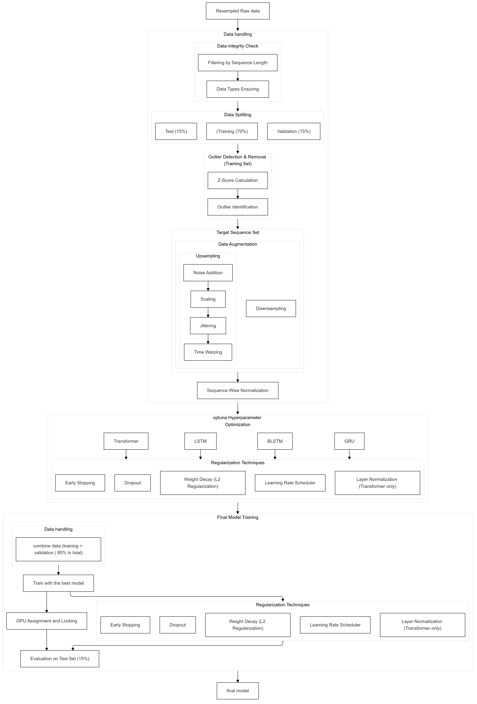
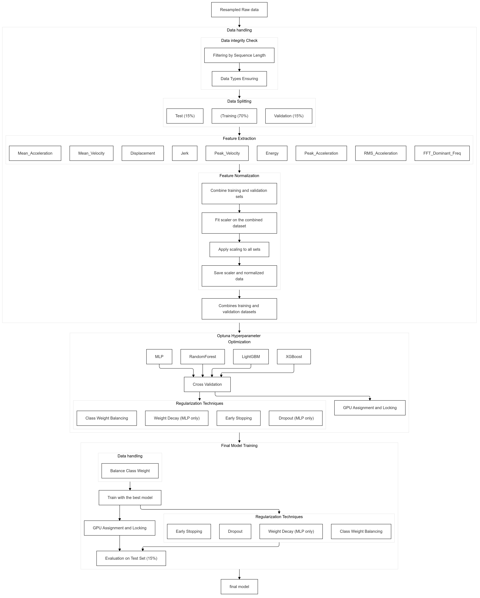
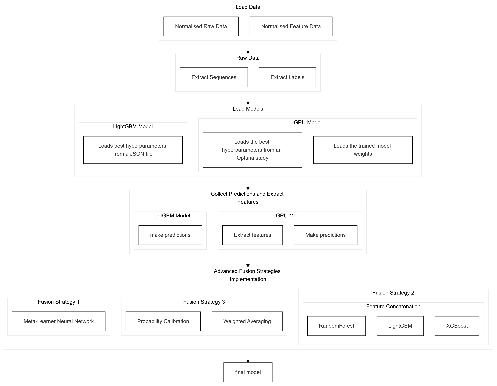

# Architecture

Ripple Structures links UWB ranging firmware, Python positioning, ML gesture recognition, and Unity visualization.

## Signal Flow

1. DW3000 transmitter nodes send ranging packets.
2. DW3000 receiver firmware records range estimates from configured transmitter anchors.
3. Receiver firmware applies calibration offsets and forwards measurements over UDP.
4. The Python positioning server filters measurements, estimates 3D position, and forwards coordinates to Unity.
5. ML scripts process raw/feature branches and fused model outputs for gesture recognition.
6. Unity visualizes tracked receiver positions in a user-supplied scene.

## Diagrams

